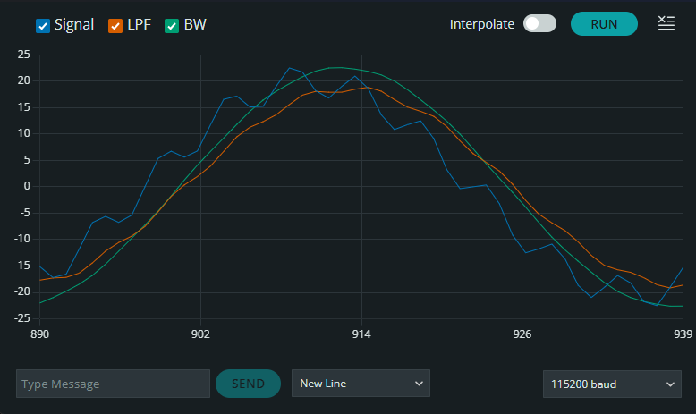

# Low Pass Filter Implementation on Arduino

## Overview

This repository provides an implementation of low-pass filters (LPF) for signal processing on Arduino or in C++ environments. It includes classes for a 1st-order Low Pass Filter and a 2nd-order Butterworth Filter, both discretized for digital systems using the **Bilinear Transform**, also known as the Tustin method. These filters are useful for attenuating high-frequency noise in signals, such as sensor data or audio processing.

### Filter Performance Comparison

  
   
  <em>Figure 1: Comparison of Raw Signal (with 20Hz noise), 1st-Order LPF, and 2nd-Order Butterworth Filter (f_c = 5Hz).</em>

---

### Key Features
* **1st-Order LPF**: Simple and fast implementation with a gradual roll-off.
* **2nd-Order Butterworth LPF**: Maximally flat frequency response in the passband with a sharper roll-off compared to the 1st-order filter.
* **Configurable**: Easily adjust cutoff frequency and sampling rate.

---

## Transfer Functions in Filter Applications

A **transfer function** $H(s)$ describes the relationship between the input and output of a system in the Laplace domain.

* **Meaning**: $H(s) = \frac{Y(s)}{X(s)}$, where $X(s)$ is the input signal and $Y(s)$ is the output.
* **LPF Behavior**: Allows low frequencies below the cutoff $\omega_0$ to pass with minimal attenuation while reducing high-frequency components.
* **Implementation**: For digital systems, continuous-time transfer functions are discretized into difference equations using the Tustin method.

---

## Mathematical Derivations

### 1. 1st-Order Low Pass Filter

**Continuous-Time Transfer Function**:

$$H(s) = \frac{\omega_0}{s + \omega_0}$$

Where $\omega_0$ is the cutoff frequency in radians/second.

**Discretization (Tustin Method)**:

By substituting $s = \frac{2}{T} \cdot \frac{z-1}{z+1}$, where $T$ is the sampling period:

$$G(z) = \frac{\omega_0 T (z + 1)}{2(z - 1) + \omega_0 T (z + 1)}$$

After rearranging to show delay elements ($z^{-1}$):

$$G(z) = \frac{\omega_0 T (1 + z^{-1})}{(2 + \omega_0 T) + (\omega_0 T - 2) z^{-1}}$$

**Difference Equation**:

$$y[n] = \alpha \cdot x[n] + \alpha \cdot x[n-1] - \beta \cdot y[n-1]$$

Where:

$$\alpha = \frac{\omega_0 T}{2 + \omega_0 T}, \quad \beta = \frac{\omega_0 T - 2}{2 + \omega_0 T}$$

---

### 2. 2nd-Order Butterworth Filter

The derivation starts from the general Butterworth formula:

$$H(s) = \frac{1}{\sum_{k=0}^{n} \frac{a_k}{\omega_0^k} s^k}$$

For $n=2$, the coefficients are derived using the recursive relationship $a_{k+1} = \frac{\cos(k\gamma)}{\sin((k+1)\gamma)} a_k$ with $\gamma = \frac{\pi}{4}$. This results in $a_0 = 1$, $a_1 = \sqrt{2}$, and $a_2 = 1$.

**Continuous-Time Transfer Function**:

$$G(s) = \frac{\omega_0^2}{s^2 + \sqrt{2} \omega_0 s + \omega_0^2}$$

**Z-Domain Transfer Function**:

Using the Tustin substitution $s = \frac{2}{T} \cdot \frac{z-1}{z+1}$:

$$G(z) = \frac{\omega_0^2 T^2 (z + 1)^2}{4(z - 1)^2 + 2\sqrt{2} \omega_0 T (z - 1)(z + 1) + \omega_0^2 T^2 (z + 1)^2}$$

The normalized Z-domain form (iterative form) is:

$$G(z) = \frac{\frac{\omega_0^2 T^2}{a_0}(1 + 2z^{-1} + z^{-2})}{1 + \frac{a_1}{a_0} z^{-1} + \frac{a_2}{a_0} z^{-2}}$$

Where:
* $a_0 = \omega_0^2 T^2 + 2\sqrt{2} \omega_0 T + 4$
* $a_1 = 2\omega_0^2 T^2 - 8$
* $a_2 = \omega_0^2 T^2 - 2\sqrt{2} \omega_0 T + 4$

**Difference Equation**:

$$y[n] = \frac{\omega_0^2 T^2}{a_0} x[n] + \frac{2 \omega_0^2 T^2}{a_0} x[n-1] + \frac{\omega_0^2 T^2}{a_0} x[n-2] - \frac{a_1}{a_0} y[n-1] - \frac{a_2}{a_0} y[n-2]$$

---

## Frequency Analysis

The frequency response is obtained by substituting $s = j\omega$ into the continuous-time transfer functions.

### 1st-Order LPF:

$$H(j\omega) = \frac{1}{1 + j(\omega / \omega_0)}$$

**Magnitude**:

$$|H(j\omega)| = \frac{1}{\sqrt{1 + (\omega / \omega_0)^2}}$$

* **Passband**: $|H| = 1$ at $\omega = 0$.
* **Cutoff**: $|H| = 1/\sqrt{2} \approx 0.707$ (-3 dB) at $\omega = \omega_0$.
* **Roll-off**: -20 dB/decade as $\omega \to \infty$.

**Phase**:

$$\angle H(j\omega) = -\tan^{-1}(\omega / \omega_0)$$

### 2nd-Order Butterworth:

$$H(j\omega) = \frac{\omega_0^2}{-\omega^2 + j\sqrt{2}\omega_0 \omega + \omega_0^2}$$

**Magnitude**:

$$|H(j\omega)| = \frac{1}{\sqrt{1 + (\omega / \omega_0)^4}}$$

* **Passband**: Maximally flat response with no ripple.
* **Cutoff**: $|H| = 1/\sqrt{2}$ at $\omega = \omega_0$.
* **Roll-off**: -40 dB/decade, providing superior high-frequency rejection.
* **Phase**: More pronounced phase lag near the cutoff frequency due to the higher order.

---

## Comparisons Between Filters

| Aspect | 1st-Order LPF | 2nd-Order Butterworth LPF |
| :--- | :--- | :--- |
| **Roll-Off** | -20 dB/decade | -40 dB/decade |
| **Passband Flatness** | Moderate | Maximally Flat |
| **Phase Distortion** | Moderate | Higher near cutoff |
| **Computational Cost** | Very Low | Moderate |
| **Memory Elements** | 2 Delay elements | 4 Delay elements |

The Butterworth filter is ideal for applications requiring a clean passband and sharp noise rejection, while the 1st-order filter is suitable for simple smoothing tasks.